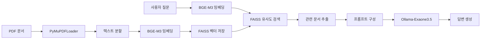

# RAG Chatbot

<div align="center">
  
  
  
  
  
  
</div>

<br>

<div align="center">
  <p><strong>? 완전 로컬 실행 가능한 교육용 RAG(Retrieval-Augmented Generation) 챗봇</strong></p>
  <p>BGE-M3 임베딩 + FAISS 벡터 검색 + Ollama-Exaone3.5 언어모델을 활용한 한국어 문서 기반 질의응답 시스템</p>
</div>

---

## Table of Contents

- [Features](#-features)
- [Architecture](#?-architecture)
- [Project Structure](#-project-structure)
- [Quick Start](#-quick-start)
- [Usage](#-usage)
- [Dataset](#-dataset)
- [Configuration](#?-configuration)
- [Development](#?-development)
- [Contributing](#-contributing)
- [License](#-license)

## Features

- **완전 로컬 실행**: 외부 API 없이 모든 처리를 로컬에서 수행
- **PDF 문서 처리**: 교육 관련 PDF 문서를 자동으로 벡터화하여 저장
- **정확한 검색**: FAISS 기반 고속 벡터 유사도 검색
- **할루시네이션 방지**: 문서 기반 답변만 제공하는 엄격한 프롬프트 설계
- **한국어 최적화**: BGE-M3와 Exaone3.5를 통한 한국어 특화 처리
- **증분 인덱싱**: 새 문서 추가 시 기존 인덱스에 효율적으로 누적

## Architecture



## Project Structure

```
RAG_Chatbot/
├── config.py              # 환경 설정 및 상수 정의
├── embedder.py            # BGE-M3 임베딩 래퍼 클래스
├── retriever.py           # FAISS 인덱스 생성 및 검색
├── qa.py                  # Ollama API 호출 및 RAG 파이프라인
├── main.py                # 메인 실행 스크립트
├── run_ollama.sh          # Ollama 설치 및 설정 스크립트
├── rag_final.ipynb        # Jupyter 노트북 (개발/테스트용)
├── pdf/                   # PDF 문서 저장 폴더
│   ├── 2022개정교육과정자유학기운영안내서.pdf
│   ├── 2025년학생안전종합계획(발송용).pdf
│   ├── 2025자유학기운영참고자료.pdf
│   ├── 2025중등교원인사업무처리요령1권.pdf
│   ├── 2025중등교원인사업무처리요령2권.pdf
│   ├── [계획]2025정보통신윤리교육및인터넷스마트폰과의존예방교육기본계획.pdf
│   └── 학교안전계획직무연수교재(최종).pdf
├── faiss_bge_m3_index/    # FAISS 벡터 인덱스 (자동 생성)
└── __pycache__/           # Python 캐시 파일
```

### Core Modules

| 파일 | 역할 | 주요 기능 |
|------|------|-----------|
| `config.py` | 설정 관리 | PDF 경로, API 엔드포인트, 모델 설정 등 |
| `embedder.py` | 임베딩 처리 | BGE-M3 모델을 LangChain과 호환되도록 래핑 |
| `retriever.py` | 문서 검색 | PDF 로딩, 텍스트 분할, FAISS 인덱스 관리 |
| `qa.py` | 질의응답 | Ollama API 호출, RAG 파이프라인 실행 |
| `main.py` | 메인 실행 | 전체 시스템 통합 및 실행 |

### Code Details

#### `config.py` - 환경 설정
```python
from pathlib import Path

PDF_PATH   = r"C:\path\to\pdf\file.pdf"  # PDF 파일 경로
INDEX_DIR  = "faiss_bge_m3_index"        # FAISS 인덱스 저장 디렉토리
CHUNK_SIZE = 800                         # 텍스트 청크 크기
CHUNK_OVER = 100                         # 청크 간 겹치는 부분
OLLAMA_API = "http://localhost:11434/api/generate"  # Ollama API 엔드포인트
MODEL_NAME = "exaone3.5:2.4b"            # 사용할 언어 모델
```

#### `embedder.py` - BGE-M3 임베딩 래퍼
```python
class BGEEmbedding(Embeddings):
    """FlagEmbedding을 LangChain과 호환되도록 래핑한 클래스"""
    
    def __init__(self, model_name="BAAI/bge-m3", fp16=True):
        self.model = FlagModel(model_name, use_fp16=fp16)
    
    def _encode(self, texts):
        # 텍스트를 벡터로 변환하고 정규화
        vecs = self.model.encode(texts, batch_size=32, max_length=8192)
        vecs = np.asarray(vecs, dtype="float32")
        vecs /= np.linalg.norm(vecs, axis=1, keepdims=True) + 1e-12
        return vecs
```

#### `retriever.py` - FAISS 인덱스 관리
```python
def build_faiss_index(embedder):
    """PDF 문서를 로드하고 FAISS 벡터 인덱스를 생성/업데이트"""
    if Path(INDEX_DIR).exists():
        # 기존 인덱스 로드
        db = FAISS.load_local(INDEX_DIR, embedder, allow_dangerous_deserialization=True)
    else:
        # 새 인덱스 생성
        loader = PyMuPDFLoader(PDF_PATH)
        docs = loader.load()
        splitter = RecursiveCharacterTextSplitter(
            chunk_size=CHUNK_SIZE, chunk_overlap=CHUNK_OVER
        )
        chunks = splitter.split_documents(docs)
        db = FAISS.from_documents(chunks, embedder)
        db.save_local(INDEX_DIR)
    return db
```

#### `qa.py` - 질의응답 시스템
```python
def ask_rag(query: str, embedder, top_k: int = 3):
    """RAG 파이프라인: 검색 → 컨텍스트 구성 → 답변 생성"""
    # 1. 벡터 검색
    db = FAISS.load_local(INDEX_DIR, embedder, allow_dangerous_deserialization=True)
    docs = db.similarity_search(query, k=top_k)
    context = "\n\n".join(d.page_content[:800] for d in docs)
    
    # 2. 프롬프트 생성 (할루시네이션 방지)
    prompt = f"""아래 [문서] 내용에 근거해서만 한국어로 답하라.
문서에 정보가 없으면 '모르겠습니다'라고 답하라.

[문서]
{context}

[질문]
{query}

[답변]"""
    
    # 3. LLM 호출
    return ask_ollama(prompt)
```

## ? Quick Start

### 1?? Prerequisites

```bash
# Python 3.8+ 필요
python --version

# Git 클론
git clone https://github.com/yourusername/RAG_Chatbot.git
cd RAG_Chatbot
```

### 2. Install Dependencies

```bash
# 필수 패키지 설치
pip install FlagEmbedding langchain langchain-community faiss-cpu PyMuPDF requests numpy
```

### 3. Setup Ollama

```bash
# Ollama 설치 및 모델 다운로드 (자동)
chmod +x run_ollama.sh
./run_ollama.sh
```

**Windows 사용자의 경우:**
```powershell
# PowerShell에서 실행
.\run_ollama.sh
```

### 4. Run the Chatbot

```bash
# 메인 스크립트 실행
python main.py
```

## Usage

### Command Line Interface

```python
from embedder import BGEEmbedding
from retriever import build_faiss_index
from qa import ask_rag

# 임베딩 모델 초기화
embedder = BGEEmbedding()

# FAISS 인덱스 생성 (최초 1회)
db = build_faiss_index(embedder)

# 질문하기
question = "학교안전사고 예방 관리 체계의 고도화 과제에 대한 담당부서는 어디고 연락처가 어떻게 돼?"
answer = ask_rag(question, embedder)

print(f"Q: {question}")
print(f"A: {answer}")
```

### Jupyter Notebook

`rag_final.ipynb` 파일을 통해 대화형으로 테스트할 수 있습니다.

```bash
jupyter notebook rag_final.ipynb
```

## Dataset

### 교육 문서 컬렉션

| 카테고리 | 문서명 | 설명 |
|----------|--------|------|
| **자유학기제** | 2022개정교육과정자유학기운영안내서 | 2022 개정 교육과정 자유학기제 가이드 |
| | 2025자유학기운영참고자료 | 2025년 자유학기제 운영 참고 자료 |
| **학교안전** | 2025년학생안전종합계획 | 학생 안전 종합 계획서 |
| | 학교안전계획직무연수교재 | 안전 계획 수립 연수 교재 |
| **교원인사** | 2025중등교원인사업무처리요령(1권) | 중등교원 인사업무 처리 가이드 |
| | 2025중등교원인사업무처리요령(2권) | 중등교원 인사업무 처리 가이드 |
| **정보윤리** | 2025정보통신윤리교육기본계획 | 정보통신 윤리 및 디지털 중독 예방 |

## Configuration

### 환경 설정 수정

`config.py` 파일을 편집하여 설정을 변경할 수 있습니다:

```python
# PDF 문서 경로 변경
PDF_PATH = r"C:\your\path\to\document.pdf"

# 텍스트 분할 크기 조정
CHUNK_SIZE = 1000  # 더 큰 청크
CHUNK_OVER = 200   # 더 많은 겹침

# 다른 모델 사용
MODEL_NAME = "llama2:7b"  # 다른 Ollama 모델
```

### BGE-M3 임베딩 설정

```python
# GPU 사용 시 (권장)
embedder = BGEEmbedding(fp16=True)

# CPU만 사용 시
embedder = BGEEmbedding(fp16=False)
```

## Development

### Testing

```bash
# 개별 모듈 테스트
python -c "from embedder import BGEEmbedding; print('Embedder OK')"
python -c "from retriever import build_faiss_index; print('Retriever OK')"
python -c "from qa import ask_rag; print('QA OK')"
```

### 성능 모니터링

```python
import time

start_time = time.time()
answer = ask_rag("your question here", embedder)
end_time = time.time()

print(f"응답 시간: {end_time - start_time:.2f}초")
```

### Example Queries

```python
# 안전 관련 질문
ask_rag("학교 안전사고 발생 시 신고 절차는?", embedder)

# 자유학기제 관련 질문  
ask_rag("자유학기제 운영 시 주의사항은?", embedder)

# 교원 인사 관련 질문
ask_rag("중등교원 전보 신청 기간은?", embedder)

# 정보윤리 관련 질문
ask_rag("정보통신 윤리 교육 시간은?", embedder)
```

### 시스템 요구사항

| 구성요소 | 최소 요구사항 | 권장 사양 |
|----------|---------------|-----------|
| **Python** | 3.8+ | 3.10+ |
| **RAM** | 8GB | 16GB+ |
| **Storage** | 10GB | 20GB+ |
| **GPU** | 선택사항 | CUDA 지원 GPU |
| **OS** | Windows/macOS/Linux | Any |

### Troubleshooting

#### 일반적인 문제 해결

1. **Ollama 연결 오류**
   ```bash
   # Ollama 서버 재시작
   ollama serve
   ```

2. **메모리 부족 오류**
   ```python
   # 청크 크기 줄이기
   CHUNK_SIZE = 400
   ```

3. **한글 인코딩 문제**
   ```python
   # UTF-8 인코딩 명시
   # -*- coding: utf-8 -*-
   ```

## Contributing

1. Fork the repository
2. Create a feature branch (`git checkout -b feature/amazing-feature`)
3. Commit your changes (`git commit -m 'Add amazing feature'`)
4. Push to the branch (`git push origin feature/amazing-feature`)
5. Open a Pull Request

### Development Guidelines

- 코드 스타일: PEP 8 준수
- 커밋 메시지: 영어로 명확하게 작성
- 문서화: 주요 함수에 docstring 작성
- 테스트: 새 기능 추가 시 테스트 코드 포함

## License

This project is licensed under the MIT License - see the [LICENSE](LICENSE) file for details.

## Acknowledgments

- **[BGE-M3](https://huggingface.co/BAAI/bge-m3)**: 고성능 한국어 임베딩 모델
- **[FAISS](https://faiss.ai/)**: Facebook AI의 벡터 유사도 검색 라이브러리
- **[Ollama](https://ollama.ai/)**: 로컬 LLM 실행 플랫폼
- **[LangChain](https://python.langchain.com/)**: LLM 애플리케이션 개발 프레임워크
- **[Exaone3.5](https://www.lgresearch.ai/)**: LG AI Research의 한국어 특화 언어모델

---

<div align="center">
  <p>Made with ?? for Korean Education</p>
  <p>
    <a href="#-table-of-contents">Back to Top</a> ?
    <a href="https://github.com/yourusername/RAG_Chatbot/issues">Report Bug</a> ?
    <a href="https://github.com/yourusername/RAG_Chatbot/issues">Request Feature</a>
  </p>
</div>
